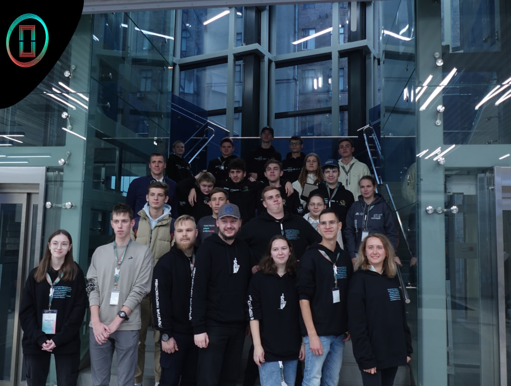

     # Привет! Это моё описание на языке разметки MD

     Меня зовут Комаров Дмитрий. Я учусь в МГТУ им. Н.Э. Баумана и развиваю сообщество глухих инженеров
     
     ## Обо мне
    Я много чем увлекаюсь, но сейчас моё внимание уделено построению сайтов внутри корпоративных систем для глухих инженеров, а также я веду свой проект по популяризации технического образования среди глухих

     ## Помимо этого я знаю несколько языков:
     - Русский (очевидно);
     - Русский жестовый язык;
     - Немецкий;
     - Английский;
     - Чешский.

     ## Контакты
     - Email: komarovda@seznam.cz
     - TG: [Открытые перспективы - популяризация технического образования для глухих](t.me/OpenPerspectives)

     